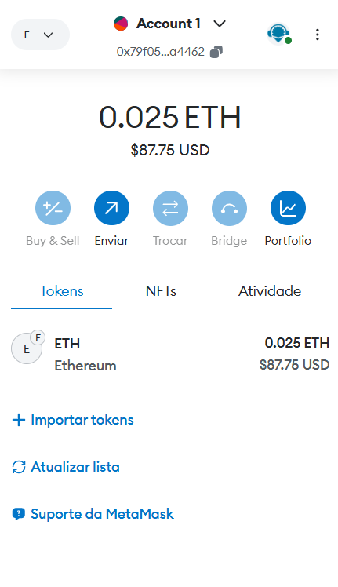
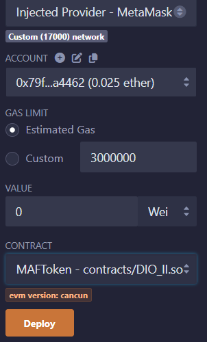
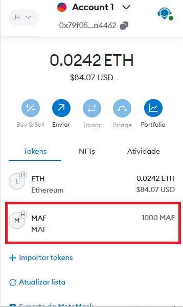
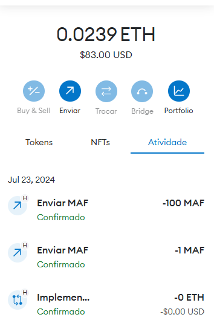

# MAFToken
Primeiro Token do Zero nos Padrões Web3

## Objetivo
Com o apoio do professor **Ricardo Zago** construir o primeiro token em homenagem a minha cidade Mafra/SC.

## Finalidade
Este token poderia ser distribuído aos alunos de cada escola que arrecadassem mais lixo reciclável, por exemplo, e no final do ano a escola que acumulasse mais tokens, ganharia um dia no parque com guloseimas e brincadeiras.
A prefeitura também poderia pagar os trabalhos voluntários dos pais com este token, para incentivar a participação da comunidade na escola.

## Tecnologias utilizadas
 * Ide Remix https://remix.ethereum.org/
 * Metamask https://metamask.io/
 * Faucet https://blastapi.io/faucets/ethereum-holesky

 ## Smart contract
```solidity
// SPDX-License-Identifier: GPL-3.0
pragma solidity ^0.8.26;
 
//Safe Math Interface
 
contract SafeMath {
 
    function safeAdd(uint a, uint b) public pure returns (uint c) {
        c = a + b;
        require(c >= a);
    }
 
    function safeSub(uint a, uint b) public pure returns (uint c) {
        require(b <= a);
        c = a - b;
    }
 
    function safeMul(uint a, uint b) public pure returns (uint c) {
        c = a * b;
        require(a == 0 || c / a == b);
    }
 
    function safeDiv(uint a, uint b) public pure returns (uint c) {
        require(b > 0);
        c = a / b;
    }
}
 
//ERC Token Standard #20 Interface
 
abstract contract ERC20Interface {
    function totalSupply() virtual public returns (uint);
    function balanceOf(address tokenOwner) virtual public returns (uint balance);
    function allowance(address tokenOwner, address spender) virtual public returns (uint remaining);
    function transfer(address to, uint tokens) virtual public returns (bool success);
    function approve(address spender, uint tokens) virtual public returns (bool success);
    function transferFrom(address from, address to, uint tokens) virtual public returns (bool success);
 
    event Transfer(address indexed from, address indexed to, uint tokens);
    event Approval(address indexed tokenOwner, address indexed spender, uint tokens);
}
 
 
//Contract function to receive approval and execute function in one call
 
abstract contract ApproveAndCallFallBack {
    function receiveApproval(address from, uint256 tokens, address token, bytes calldata data) virtual public;
}
 
//Actual token contract
 
contract MAFToken is ERC20Interface, SafeMath {
    string public symbol;
    string public name;
    uint8 public decimals;
    uint public _totalSupply;
 
    mapping(address => uint) balances;
    mapping(address => mapping(address => uint)) allowed;
 
    constructor() public {
        symbol = "MAF";
        name = "Mafra-SC Coin";
        decimals = 2;
        _totalSupply = 100000;
        balances[0x340F5d588dd2B3d61065cFb04132024f8F7c34CD] = _totalSupply;
        emit Transfer(address(0), 0x340F5d588dd2B3d61065cFb04132024f8F7c34CD, _totalSupply);
    }
 
    function totalSupply() override public returns (uint) {
        return _totalSupply  - balances[address(0)];
    }
 
    function balanceOf(address tokenOwner) override public returns (uint balance) {
        return balances[tokenOwner];
    }
 
    function transfer(address to, uint tokens) override public returns (bool success) {
        balances[msg.sender] = safeSub(balances[msg.sender], tokens);
        balances[to] = safeAdd(balances[to], tokens);
        emit Transfer(msg.sender, to, tokens);
        return true;
    }
 
    function approve(address spender, uint tokens) override public returns (bool success) {
        allowed[msg.sender][spender] = tokens;
        emit Approval(msg.sender, spender, tokens);
        return true;
    }
 
    function transferFrom(address from, address to, uint tokens) override public returns (bool success) {
        balances[from] = safeSub(balances[from], tokens);
        allowed[from][msg.sender] = safeSub(allowed[from][msg.sender], tokens);
        balances[to] = safeAdd(balances[to], tokens);
        emit Transfer(from, to, tokens);
        return true;
    }
 
    function allowance(address tokenOwner, address spender) override public returns (uint remaining) {
        return allowed[tokenOwner][spender];
    }
 
    function approveAndCall(address spender, uint tokens, bytes memory data) public returns (bool success) {
        allowed[msg.sender][spender] = tokens;
        emit Approval(msg.sender, spender, tokens);
        ApproveAndCallFallBack(spender).receiveApproval(msg.sender, tokens, address(this), data);
        return true;
    }
 
    receive () external payable {
        revert();
    }
} 
```

## Dinamica do estudo

- Primeiro, criei uma carteira Web3 no metamask e conectei na rede teste https://eth-holesky.public.blastapi.io.

- Segundo, acessei o faucet desta rede e peguei alguns tokens de teste para executar o contrato.


- Terceiro, acessei o remix e compilei o código do smart contract que cria o token.


Como resultado foi adicionado 1000 MAFToken em minha carteira.


O token ficou funcional e as operações de transferência estão na figura abaixo

